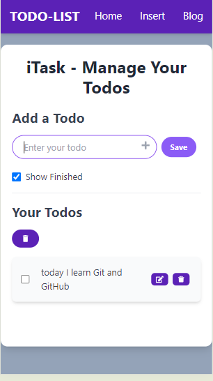

# TODO-list

You can add your daily work in this repository where I created a TODO list.

## Features

- Add tasks
- Delete tasks
- Mark tasks as complete
- Save data in local storage

This TODO list application allows you to manage your daily tasks efficiently. You can add new tasks, delete tasks that you no longer need, and mark tasks as complete. All your data is saved in the local storage, so your tasks will persist even after you refresh the page.

This project is built using React and Tailwind CSS, providing a modern and responsive user interface.

# Created by psycho -70
